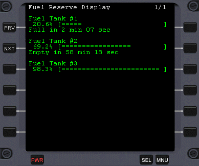

Orbiter FuelReserveMFD
======================

FuelMFD is an addon for the space flight simulator [Orbiter](http://orbit.medphys.ucl.ac.uk/) that displays your actual fuel status for each tank in a vessel, and shows the remaining time until the tanks are empty (or full) at the current fuel flow rate.

Displays up to 6 fuel tanks per page.

Build Instructions:
-------------------
TODO

Installation:
-------------
* Copy FuelMFD.dll in your `Orbiter\Modules\Plugin\`-folder
* Activate the module in the "Modules" tab in Orbiter Launchpad.

That's it ;)

Usage:
------

* Open FuelMFD (`shift-E`)
* PRV: previous page (`shift-P`)
* NXT: next page (`shift-N`)
* MOD: switches time format: i.e. 400 min 00 sec <-> 24ks

If the fuel in a tank drops below 5% or the remaining time drops below 1 minute, the specific bar for this tank changes to a red color.
